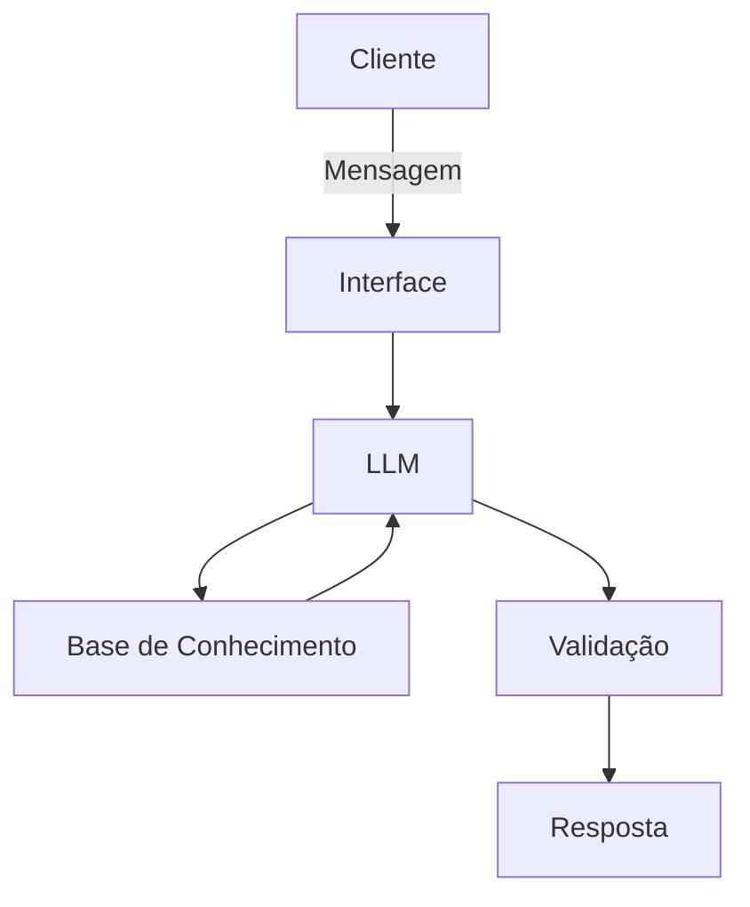

# Documentação do Agente

## Caso de Uso

### Problema
> Qual problema financeiro seu agente resolve?

- Falta de controle em tempo real: 
Usuários só percebem que gastaram demais no final do mês, quando a fatura fecha.
Compras impulsivas: Dificuldade em manter a disciplina financeira no dia a dia.
Esquecimento de assinaturas: Cobranças recorrentes ou assinaturas esquecidas acumulando gastos desnecessários.
Surpresas no saldo: Saídas de dinheiro não planejadas que comprometem o orçamento mensal.

### Solução
> Como o agente resolve esse problema de forma proativa?

- Notificação instantânea de compra: A cada compra, o usuário recebe um alerta, aumentando a consciência sobre o gasto.
Alertas de limite de categoria: O usuário define orçamentos (ex: R$ 500 em "iFood"). Ao atingir 80% e 100% desse valor, o app envia um alerta.
Resumo de gastos semanais: Relatório automático mostrando quanto foi gasto e quanto resta para evitar o "estresse financeiro".
Aviso de gastos recorrentes: Notificação antes que uma assinatura anual ou mensal seja debitada.

### Público-Alvo
> Quem vai usar esse agente?

- Pessoas organizando finanças: Jovens profissionais ou estudantes que buscam controle financeiro.
Famílias/Casais: Pessoas que precisam gerenciar orçamento conjunto e evitar surpresas no saldo.
Empreendedores/MEI: Pequenos empreendedores que separam finanças pessoais das profissionais e precisam gerenciar fluxo de caixa.
Consumidores impulsivos: Pessoas que desejam criar alertas para evitar compras supérfluas.

---

## Persona e Tom de Voz

### Nome do Agente
Max.

### Personalidade
> Como o agente se comporta? (ex: consultivo, direto, educativo)

-Educativo, direto

### Tom de Comunicação
> Formal, informal, técnico, acessível?

- Informal, Técnico, Acessível, Educativo.

### Exemplos de Linguagem
- Saudação: "Olá! Como posso ajudar com suas finanças hoje?"
- Confirmação: "Entendi! Deixa eu verificar isso para você."
- Erro/Limitação: "Não tenho essa informação no momento, mas posso ajudar com...

---

## Arquitetura

### Diagrama

### Componentes

| Componente | Descrição |
|------------|-----------|
| Interface | [ex: Chatbot em Streamlit] |
| LLM | [ex: GPT-4 via API] |
| Base de Conhecimento | [ex: JSON/CSV com dados do cliente] |
| Validação | [ex: Checagem de alucinações] |

---

## Segurança e Anti-Alucinação

### Estratégias Adotadas

- [ ] [ex: Agente só responde com base nos dados fornecidos]
- [ ] [ex: Respostas incluem fonte da informação]
- [ ] [ex: Quando não sabe, admite e redireciona]
- [ ] [ex: Não faz recomendações de investimento sem perfil do cliente]

### Limitações Declaradas
> O que o agente NÃO faz?

[Liste aqui as limitações explícitas do agente]
